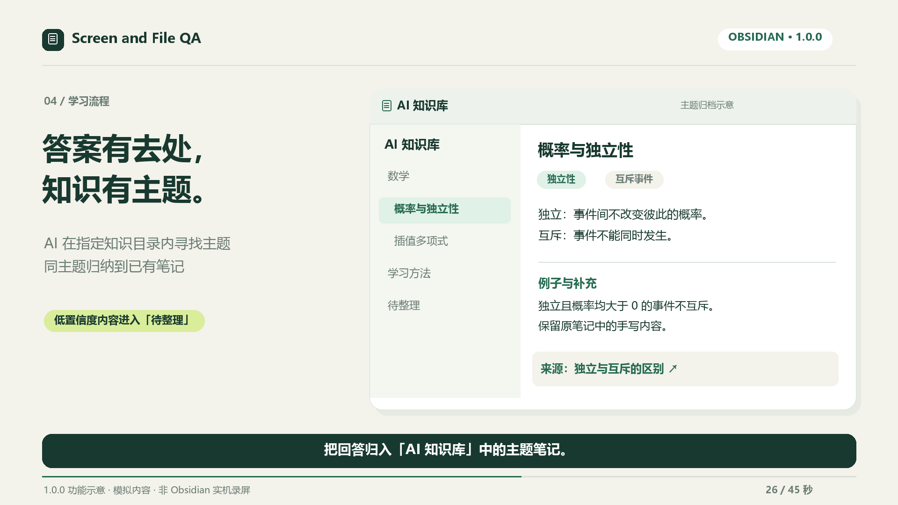

# Screen and File QA · 屏幕与文件问答

[简体中文](README.zh-CN.md) · [Changelog](CHANGELOG.md) · [Privacy and security](SECURITY.md)

An Obsidian desktop plugin for asking AI about your screen or the current file, and reviewing Markdown note revisions before applying them.

The plugin is free and open source. AI providers may require their own account, API key or subscription and charge for requests. Supported remote services are OpenAI, DeepSeek, the service used by your signed-in Codex CLI and any compatible endpoint you configure. The plugin has no analytics or advertising.

[Watch the 1.0.0 video (45 seconds)](https://github.com/clarkdonaldtfgbw5081-del/current-note-chat/releases/download/1.0.0/Screen-and-File-QA-1.0.0-45s.mp4) · [Storyboard and editable source](docs/media/promo-1.0.0/README.zh-CN.md)

*1080p · Chinese captions · no audio. Illustrated workflow with simulated content, not native Obsidian recordings. Covers queued questions, source-note appends, screenshot attachments, topic archiving, Feynman learning and reviews.*



*First-release feature illustration with simulated content, not a native Obsidian screenshot. The actual panel follows your theme and supports Chinese/English controls. [See eight illustrated workflow frames](docs/SCREENSHOTS.md).*

**Privacy:** Screen Q&A captures the selected display, including other application windows. A preview is shown before sending by default. The question, recent conversation and screenshot or selected file excerpts are sent to your configured provider. API keys use Obsidian SecretStorage. Chat histories and exported notes are local vault data that may be copied by vault sync. See [SECURITY.md](SECURITY.md) for storage, cancellation and Codex details.

Community review may flag filesystem access and child processes used by the optional Codex CLI backend, clipboard writes performed by the Copy answer button, and Function constructors inside the bundled PDF.js dependency. PDF parsing sets `isEvalSupported: false` to disable PDF-generated function compilation. The plugin's own code does not evaluate AI answers as JavaScript or shell commands. See [Review notices](docs/COMMUNITY_REVIEW.md) for the capabilities and release-asset checks.

## Features

- **Screen Q&A:** capture the Obsidian display or the display under the cursor; review the screenshot before sending. A missing display match produces an error instead of capturing a different monitor.
- **File Q&A:** read Markdown, PDF, DOC/DOCX and text files including CSV, JSON, HTML, XML and YAML. Long documents use relevant excerpts; PDF excerpts retain page labels.
- **Feynman learning:** choose one concept, explain it in plain language, solve a transfer problem and teach it back. Identify gaps, request small hints, restore progress, export a report and start a review round.
- **Revise note:** generate a revision of the active Markdown note or selected text, edit it in a side-by-side preview, then apply. Changes made after the preview block applying it. Editor changes support undo.
- **Stop and retry:** stop pending work and retry the specific failed question. Recent in-memory snapshots reuse the original context or screenshot; older retries explicitly read fresh context.
- **Streaming:** stream answers where supported. Authentication and ambiguous network failures never trigger automatic resending. A setting enables non-streaming Obsidian requests when browser streaming is blocked.
- **Persistent history:** retain up to 80 messages per conversation and 40 recent conversations in memory and on disk.
- **Automatic conversation notes:** each conversation updates one Markdown note by default, including questions, responses and learning progress. Choose separate notes per answer or disable automatic saving in settings.
- **Write back to the asked note:** after an answer completes, the question is appended to the end of the asked Markdown note (screen questions go to the Markdown note open when submitted or queued). Screenshots are saved as vault attachments using Obsidian's attachment settings and embedded before the question. Toggle whether the AI answer is included; notes inside AI Q&A and knowledge folders are never modified.
- **Question queue:** the composer stays editable while an answer streams. Enter queues up to five pending questions as visible tasks that run automatically in order afterwards; a queued screenshot question is captured when it runs, not when it was typed.
- **AI knowledge archiving:** summarize complete answers into topic notes within AI Knowledge, reuse an existing topic when its title clearly matches, and send uncertain classifications to Inbox.
- **Providers:** Codex CLI, DeepSeek, OpenAI and OpenAI-compatible Chat Completions endpoints. Text-only and image capabilities are checked separately.
- **Bilingual interface:** English and Simplified Chinese, following the Obsidian locale.

## Installation

Requires Obsidian **1.13.0 or newer** on desktop. Mobile is not supported.

Open **Settings → Community plugins → Browse**, search for **Screen and File QA**, install it and enable it. Alternatively, select **Add to Obsidian** on the [official plugin page](https://community.obsidian.md/plugins/current-note-chat). [GitHub 1.0.0 first release](https://github.com/clarkdonaldtfgbw5081-del/current-note-chat/releases/tag/1.0.0) provides manual installation assets. The community directory may synchronize later; check its displayed version before installation.

For manual installation, extract the **plugin ZIP** from a release into your vault's configuration directory under `plugins/current-note-chat/`. The default configuration directory is `.obsidian`; it can be customized.

Alternatively, copy these three release assets into that directory:

```text
main.js
manifest.json
styles.css
```

Enable **Screen and File QA** in Settings → Community plugins; search for `Screen and File QA` to find it among installed plugins. The controls follow the Obsidian interface language. The PDF worker and complete bundled license notices are embedded in `main.js`; no separate worker or `node_modules` is needed. The source ZIP is for development, not installation.

## Configure a provider

| Backend | Setup | Screen Q&A |
| --- | --- | --- |
| Codex CLI | Install and sign in separately. Supply the executable path if auto-detection fails. | Depends on the CLI model's image support. |
| DeepSeek | Select an API secret and enter a currently supported model ID. | Requires a model and endpoint supporting image input. |
| OpenAI | Select an API secret and enter a currently supported model ID. | Requires a vision-capable model. |
| Custom API | Enter the full Chat Completions URL, model ID and optional API secret. | Requires compatible `image_url` input. |

Remote endpoints require HTTPS. HTTP is allowed only for `localhost`, `127.0.0.1` and `[::1]`. Do not put credentials in the URL.

Codex runs an ephemeral read-only session in a temporary directory. It locates an executable outside the vault, reads the installed CLI's version/help output and uses its existing external authentication/configuration. It writes a temporary screenshot outside the vault when an image is needed and removes it when the process exits. Codex's sandbox restricts writes but does not isolate reads to the supplied excerpts; the CLI may read files outside the vault according to its permissions. By default **Ignore Codex user configuration** adds `--ignore-user-config` while retaining the local login. Your CLI must support this flag; update it or deliberately turn off configuration isolation if it does not. Configuration isolation was checked against local CLI `0.158.0-alpha.2.1`; compatibility with other CLI releases must be verified with `codex exec --help`. Codex is not an offline model simply because the executable runs locally.

## Use the plugin

1. Open the floating chat icon, ribbon icon or command palette command.
2. Select **Screen** or **File** under Source, enter a question and press Send. Enter sends; Shift+Enter inserts a new line.
3. In Screen Q&A, inspect the preview and choose **Send this screenshot** or Cancel.
4. Use **Stop** to stop waiting, or **Retry this question** on a failed response. Retried screenshots are previewed again when previews are enabled.
5. While an answer is streaming, the composer stays editable. Enter queues the next question (up to five) instead of discarding it; queued questions appear above the composer, can be removed individually and run automatically in order when the current answer finishes. Returning to the file of a queued question also starts it. Stop or request failure pauses the queue until Resume or another explicit submission. Queues are held in memory and cleared on unload; Feynman submissions remain locked during assessment.
6. For editing, open a Markdown note, optionally select text, enter an instruction and choose the pencil icon (**Revise note**). Inspect the original/revised text before applying.
7. Conversations automatically update a note in **AI Q&A**. The header's file icon (**View note**) opens it. The plus icon (**New chat**) retains the existing note and starts a new note for the next conversation. When **Append questions to the asked note** is on, each finished question is also appended to the asked Markdown note (screen questions to the note open when submitted or queued), with screenshots saved as attachments and embedded. Icon tooltips explain each action; the settings icon opens this plugin's settings.

Settings provide **Check connection**, **Check File Q&A** and **Check Screen Q&A**. The file check sends synthetic text; the screen check sends a generated letter image and verifies that it was identified correctly. Checks can incur small provider charges and never capture the real screen.

### Learn with the Feynman method

1. Open the relevant file or display the source on screen. Select the source mode, then **Feynman learning**, or use the **Open Feynman learning** command.
2. Enter one concept and select **Start learning**. This first step asks for your own explanation without making a provider request.
3. Explain what it means, why it works and an example. The tutor identifies gaps against the source; unresolved gaps keep you in this stage.
4. After the explanation passes, solve a new application problem with reasoning. Then teach a beginner again, adding a new example and limitations.
5. Use **Give me a hint** when stuck. Hints never count as a pass and preserve your draft answer.
6. After all three stages have answer evidence, the UI says **This round passed**. The conversation note automatically updates its learning record; use **View note** to read it. **Start review** tests the same topic in this conversation. **New topic** keeps the old note and starts a new learning conversation and note.

A pass is an AI assessment of this round, not a guarantee of lasting mastery. Review the next day without looking at the source. Insufficient material, invalid feedback and cancelled requests never advance the stage. Learning feedback uses a complete, non-streaming JSON response; ordinary Q&A streaming remains available.

Learning is separate from Q&A history. File excerpts are frozen for the round and stored locally with progress; use **New topic** to update changed material. Screen rounds reuse the first approved screenshot, sending it to the configured provider with each assessment or hint. Images exist only in the bounded ten-minute memory cache; expiration, eviction or restart requires a new topic and capture. Disabling previews also applies to learning captures.

**Automatic note saving** offers **One note per conversation (default)**, **One note per answer**, and **Off**. The default starts recording with the first message and updates the same note through questions, hints and reviews. Per-answer mode saves each successful provider response separately and includes a learning report on the final Feynman response. Manual **Export** remains available in per-answer and off modes. Previously disabled auto-save settings remain disabled on upgrade.

Choose a vault folder in **Conversation notes folder**, defaulting to **AI Q&A**. Folder changes apply to new conversations; existing ones keep updating their original note. Renaming or moving a conversation note preserves its binding. Deleted or repurposed notes are replaced with a new note without overwriting unrelated content.

### Automatically organize knowledge

**AI classification and archiving** is enabled by default when automatic note saving is enabled. After a complete Q&A answer is saved, a background request to the configured provider summarizes it and chooses a knowledge note. Feynman rounds archive their report only after completion; hints and unfinished assessments remain in the conversation.

The default knowledge folder is **AI Knowledge** (**AI 知识库** in a Chinese interface). Retrieval traverses only this folder and its subfolders, using question/answer keywords, bilingual synonyms and local aliases. Only candidate titles and paths are sent for classification; aliases and candidate contents stay local. The current source, transcript and Inbox are excluded. A clearly matching concept receives an appended section; otherwise the plugin creates a topic note inside one to three category folders. Handwritten content stays intact and archived sections link to their full conversation and source when available.

For example, a probability answer may go to AI Knowledge/Mathematics/Probability/Independence.md. This is an illustration: category names and classification depend on the model. Classification is a suggestion, not a verified fact. Low-confidence results go to **Inbox**. If classification fails or returns an unsafe destination, Inbox retains the original answer for review. Stopped and failed Q&A answers are not classified.

The extra request can incur provider charges. It sends up to 8,000 question characters, 24,000 answer characters and 120 candidate names/paths; long answers may therefore produce a partial summary, while the full conversation remains available. There is no full-vault content indexing. Change **Knowledge notes folder**, disable **AI classification and archiving**, or use the command **Archive current answer to a knowledge note** to archive a completed answer manually. Turning off automatic note saving also stops automatic classification. Cancelled jobs stay cancelled even if settings are quickly re-enabled. Previously saved answers are not retroactively classified.

## Data and limits

### Recovery, consolidation and review plans

Conversation saving must succeed before automatic classification. Failed saving retains a recovery task. The local journal stores classification results and prepared writes, allowing completed classifications to resume without another provider request. Uncertain in-flight requests pause for an explicit retry. Up to 20 jobs retain answers of up to 64,000 characters; disabling archiving/automatic saving or changing the knowledge folder cancels old jobs. Source renames and automatic/manual Feynman archiving share stable identities within the 400-record archive history.

Use **View archive tasks and usage** to inspect failures, retry, dismiss tasks or undo recent unchanged additions. Edited or shifted sections cannot be safely undone. **Classification model** can select a text model from the same API provider; Codex keeps its own configuration. **Daily classification request limit** counts reservations, failed and interrupted attempts, not monetary billing, and does not limit ordinary Q&A. Recent identical content reuses archived results. Status updates affect only the archive row instead of rerendering the entire conversation.

Automatic appends skip identical summary text and retain new source links. For semantic consolidation, open a knowledge note and use **Consolidate current knowledge note (preview)**. This explicitly sends the current note or selection to the Q&A model and requires applying a preview; handwritten notes are never automatically rewritten. Select a passage for notes longer than 12,000 characters.

Feynman completion records local **1, 3, 7 and 14 day** review plans, retaining up to 100 topics. Early practice does not advance the interval or count as delayed retention evidence. Plans send no background requests or system notifications. Select **Review plan** or **View knowledge review plan**, put the material aside and start a new round. Three application difficulty levels request direct use, transfer or counterexamples. A limited source-grounded numerical check can veto inconsistent independence conclusions for fully specified probability exercises; it is not a general mathematical verifier. Provider classification quality and lasting learning outcomes still require separate evaluation.

See the [1.0.0 flow audit](docs/FLOW_AUDIT_1.0.0.zh-CN.md) and the [Chinese implementation report](docs/OPTIMIZATION_PROGRESS.zh-CN.md) for validation and remaining work.

- New history is stored in plugin `data.json` via Obsidian `loadData`/`saveData`, alongside settings. Secret names are stored, not API secret values.
- Appending to the asked note modifies that note with a question callout (optionally followed by the answer) and stores screenshot attachments using Obsidian's attachment settings. Appended question IDs are kept in plugin data so a retried answer never appends twice. Notes inside AI Q&A and knowledge folders are never modified, and non-Markdown targets are skipped.
- Learning progress retains up to twenty recent sources, including topics, gaps, accepted answers and frozen file excerpts, but no images. Learning transcripts share the overall forty-conversation/eighty-message limits.
- Saved conversation notes retain earlier turns beyond the in-memory eighty-message limit. Handwritten additions and edits to unchanged turns remain intact; a retry updates its original response. Streaming fragments are excluded, while stopped or failed responses are labeled incomplete. Note bindings persist after restart.
- Existing `sessions.json` is read once when no migrated history exists. The original file is retained; newly saved history goes into `data.json`.
- Screenshot retry snapshots remain in memory for up to ten minutes, subject to a bounded cache, and are cleared on unload. They are not persisted in chat history.
- Files over 25 MB are rejected. Extracted PDF/Word text has a two-million-character limit. File context is normally limited to 6,000 characters; revisions to 12,000 characters; questions to 8,000 characters.
- DOCX archives are limited to 1,000 entries, 32 MB per decompressed entry and 64 MB total; ZIP64 DOCX archives are rejected.
- Scanned PDFs need OCR. Use Screen Q&A for visible scanned pages; the plugin does not provide OCR or claim to summarize an entire document from excerpts.
- Non-streaming Obsidian requests do not expose native transport cancellation. Late responses are ignored, but a provider may still process a stopped request and charge for it.
- OS or application crashes can leave a Codex temporary screenshot file. Generated Markdown can reference remote content that Obsidian loads while rendering.

## Compatibility and troubleshooting

| Environment | Considerations |
| --- | --- |
| Windows desktop | A matching display ID is required; mixed-DPI and multi-monitor capture should be tested. |
| macOS desktop | Grant screen-recording permission to Obsidian and restart it if required. |
| Linux desktop | X11/Wayland support depends on Electron and the desktop portal. Missing display identification fails safely. |
| Mobile | Unsupported. |

- **Browser request/CORS error:** turn off **Stream answers** and retry explicitly. The plugin does not automatically resend ambiguous network failures.
- **401/403:** select the correct SecretStorage entry and check provider permissions.
- **Screen check fails but file check succeeds:** use File Q&A or select a model with image input.
- **No PDF text:** the PDF may be scanned, encrypted or malformed. Try a selectable-text PDF or Screen Q&A.
- **Revision blocked:** the file, editor, mode or contents changed. Regenerate from the latest note.
- **History/save error:** check output paths, disk space and permissions. Keep backups when troubleshooting migration.

Automated tests cover parser, provider, cancellation and migration behavior. They do not establish that OS screen capture works on every platform. See the [manual release checklist](docs/RELEASE_CHECKLIST.md).

## Development and releases

Use Node.js 22.13+:

```sh
npm ci --ignore-scripts
npm run check
npm run package
```

`npm run dev` watches the modular JavaScript source. `src/types.d.ts` documents message and request contracts. Production builds embed the matching worker and complete license notices. The lockfile records exact dependencies.

`npm run package` creates clean installation and source ZIPs in `dist/`, plus `SHA256SUMS.txt`. Explicit file allowlists exclude settings, history, local backups, npm caches and dependencies. Extract the source ZIP to use it as a standalone repository.

Before releasing, update `package.json`, `manifest.json`, `versions.json`, the changelog and `docs/RELEASE_NOTES.md`. A version change on `main`, an exact version tag or a manual Release workflow run starts the three-platform checks. After they pass, GitHub Actions builds the assets and publishes the corresponding release. The tag must exactly equal the manifest version, for example `1.0.0`. Follow the [official submission guide](https://docs.obsidian.md/plugins/releasing/submit-plugin) for community-directory listing.

## License

MIT. See [LICENSE](LICENSE) and the generated [third-party notices](THIRD_PARTY_LICENSES.md).
