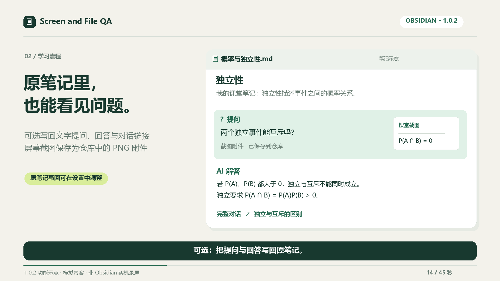
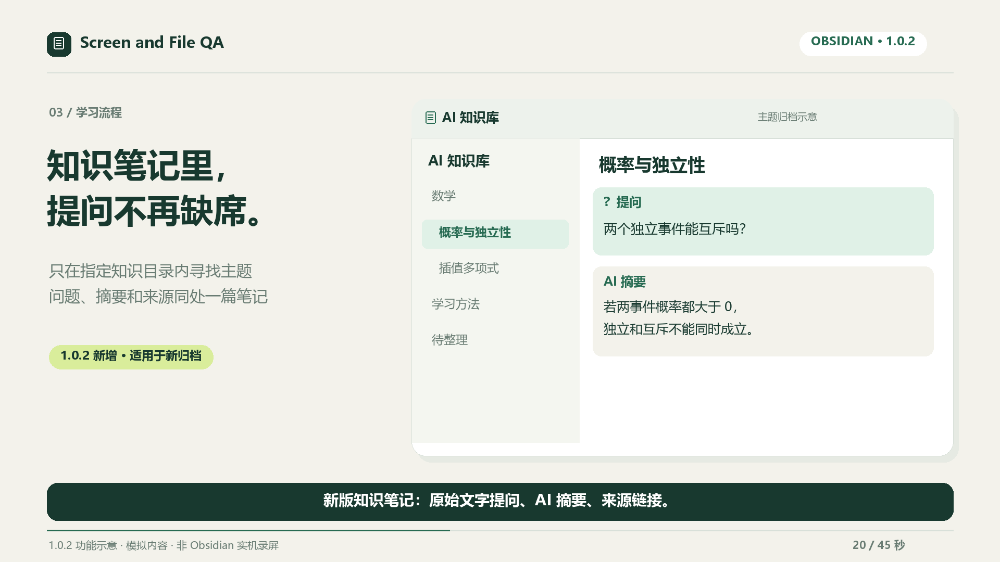
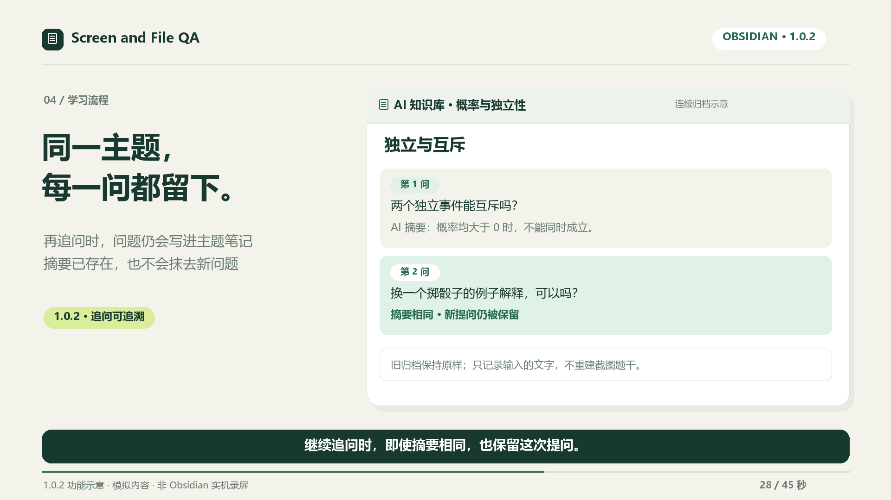

# 屏幕与文件问答

[English](README.md) · [更新记录](CHANGELOG.md) · [隐私与安全说明](SECURITY.md)

一个 Obsidian 桌面插件：向 AI 提问屏幕画面或当前文件，也可以预览并应用 Markdown 笔记改写。

插件免费开源。AI 服务可能需要独立账号、API 密钥或订阅，并按请求收费。支持 OpenAI、DeepSeek、已登录 Codex CLI 使用的服务及你填写的兼容接口。插件不包含统计追踪或广告。

[观看 1.0.2 宣传片（45 秒）](docs/media/promo-1.0.2/Screen-and-File-QA-1.0.2-45s.mp4) · [六张新版功能图与制作说明](docs/media/promo-1.0.2/README.zh-CN.md) · [1.0.2 发布页](https://github.com/clarkdonaldtfgbw5081-del/current-note-chat/releases/tag/1.0.2)

*1080p · 中文字幕 · 无音轨。使用虚构内容绘制的功能示意，非实机录屏；展示原始文字提问、AI 摘要和来源如何共同进入知识笔记。*

## 1.0.2：从提问到知识笔记

对话默认自动保存到同一篇笔记；按需把提问写回原笔记；归档到「AI 知识库」时，**新生成的主题笔记会保留原始文字提问、AI 摘要和来源链接**。即使两次摘要相同，后一次提问也会留下。







旧归档保持原样；屏幕问题只记录输入的文字，不会从截图重建完整题干。[查看六张新版功能图与说明 →](docs/media/promo-1.0.2/README.zh-CN.md)

## 图文了解

[按步骤上手](docs/QUICKSTART.zh-CN.md) · [八张功能说明图](docs/SCREENSHOTS.zh-CN.md)

*以下是 1.0.0 首发功能示意，使用模拟内容，非原生 Obsidian 截图。实际界面跟随主题；点击图片可以放大查看。*

### 1. 对文件或屏幕提问

打开资料、选择来源、输入一个具体问题。屏幕问答默认先预览再发送；同一对话会自动更新同一篇笔记。


### 2. 回答时继续追问

输入框保持可编辑，按 Enter 排队，最多五条。停止或服务商出错后，待执行问题暂停，主动继续才发送。


### 3. 问题与回答回到原笔记

将问题、可选回答和完整对话链接追加到被提问的 Markdown 笔记，截图保存为 PNG 附件。原笔记写回与对话保存可以分别设置。


### 4. 按主题归入知识库

AI 只在指定知识目录内寻找主题笔记，保留手写内容和来源链接；低置信度结果进入待整理。1.0.2 起新归档还会保留原始文字提问。分类可能增加 AI 用量。


### 5. 用费曼学习检查理解

用自己的话解释，完成应用题，再讲给初学者。反馈指出薄弱点，小提示不算阶段通过；AI 评估需要核对。


### 6. 到期再练，留下学习记录

完成学习后安排本地 1、3、7、14 天复习，主动选择知识点开始练习；计划不会到期就自动请求 AI。


[查看保存位置、常用设置和完整学习流程 →](docs/QUICKSTART.zh-CN.md)

**隐私：** 屏幕问答会截取指定显示器，画面可能包含其他应用窗口。默认先预览，确认后才发送。问题、近期对话、截图或选取的文件片段会发送给你配置的 AI 服务商。API 密钥使用 Obsidian SecretStorage；聊天记录和导出的问答笔记属于本地仓库数据，可能随仓库同步或备份。服务商自己的数据保留政策仍然适用。

社区审核可能提示：可选 Codex CLI 连接使用本机文件和子进程；“复制回答”按钮写入剪贴板；内嵌 PDF.js 依赖含有 Function 构造器。PDF 解析已设置 `isEvalSupported: false`，关闭由 PDF 内容生成的函数编译。插件自身不会把 AI 回答当作 JavaScript 或 Shell 命令执行。各项用途和发布文件说明见[审核提示说明](docs/COMMUNITY_REVIEW.md)。

## 功能

- 屏幕问答：截取 Obsidian 所在显示器或鼠标所在显示器，发送前预览。匹配不到显示器时明确报错，不会自动换成另一块屏幕。
- 文件问答：支持 Markdown、PDF、DOC/DOCX，以及 TXT、CSV、JSON、HTML、XML、YAML 等文本。长文件选取相关片段，PDF 保留页码。
- 跨对话记忆：每次普通提问前，自动从知识库笔记（含别名）和已回答的历史问题中召回最多 3 条相关片段，作为不可信背景数据注入；当前问题不会被当成旧记忆，命中计数只提高相关内容的排序（无额外请求）。可在设置中开关。
- 学习画像：首次使用弹出 30 秒向导；普通问答可先给直接答案，再按所选设置讲解原理、附 2-3 个由易到难的例题。基础水平、详细讲解、例子和背景补充可在设置中分别配置；全部未设置时保持原有简明回答。
- 费曼学习：选一个知识点，依次完成“自己的话解释 → 应用题 → 再次讲清楚”。显示具体薄弱点，可请求小提示、保存学习进度、导出学习记录和开始复习。
- 笔记改写：修改当前打开的 Markdown 笔记或选中内容。原文与改写并排显示，可先手动调整。笔记发生变化时阻止覆盖，编辑器中的修改可撤销。
- 停止与重试：可以停止等待，或重试指定的问题。近期重试复用内存中的原始上下文；原始截图仍可预览。缓存失效时会提示重新读取文件或截图。
- 流式回答：逐步显示回答，识别异常结束。认证错误和不明确的网络错误不会自动重发；可在设置中关闭流式回答。
- 历史保存：内存和磁盘都最多保留 40 个近期会话，每个会话最多 80 条消息。
- 对话笔记：默认每个对话自动更新同一篇 Markdown 笔记，包含提问、回答和学习进度，无需手动导出。可在设置中改为逐条保存或关闭。
- 写回被提问的笔记：回答完成后自动把提问追加到被提问的 Markdown 笔记末尾（屏幕提问绑定提交或排队时打开的 Markdown 笔记）；截图按 Obsidian 附件设置保存为附件并嵌入。可选择连同回答一起写入，或只记录问题。「AI 问答」与知识库目录中的笔记不会被写入。
- 问题排队：回答进行中输入框仍可输入，回车把下一个问题排入待执行队列（最多 5 条，可见、可移除），当前回答完成后按顺序自动执行；排队的问题跟随各自文件，切回该文件时也会自动执行，截图在执行时才截取。停止或请求失败后暂停队列，点击继续或主动提交后再执行；队列仅在内存中保存，停用后清除。费曼学习仍等待当前阶段评估结束。
- 服务商：Codex CLI、DeepSeek、OpenAI、自定义兼容 Chat Completions 接口。
- 界面：随 Obsidian 界面语言显示中文或英文，保留主题配色。紧凑来源切换、学习页签和图标工具栏，回答标题和公式使用适合面板的字号。

## 安装

需要 **Obsidian 1.13.0 或更新版本**，仅支持桌面端。

在“设置 → 第三方插件 → 浏览”中搜索 **Screen and File QA**，安装后启用。也可以从[官方插件页面](https://community.obsidian.md/plugins/current-note-chat)点击 **Add to Obsidian**。[GitHub 1.0.2 发布版](https://github.com/clarkdonaldtfgbw5081-del/current-note-chat/releases/tag/1.0.2)提供手动安装文件。社区目录可能稍后同步，请以页面实际显示的版本为准。

从 GitHub Release 下载 **plugin ZIP**，解压到仓库配置目录的 `plugins/current-note-chat/` 中。默认配置目录为 `.obsidian`，也可能被用户改过。

也可以只复制以下三个发布文件：

```text
main.js
manifest.json
styles.css
```

在“设置 → 第三方插件”启用“Screen and File QA”，搜索“Screen and File QA”即可在已安装列表中找到。官方目录要求使用英文发布名称，插件面板和设置仍按 Obsidian 界面语言显示中文。PDF worker 和依赖许可证已嵌入主文件，不需要额外复制 worker 或 `node_modules`。**source ZIP 是开发源码包，不是安装包。**

## 配置

| 连接方式 | 必要配置 | 屏幕问答 |
| --- | --- | --- |
| Codex CLI | 单独安装并登录；自动查找失败时填写可执行文件路径。 | 需要当前 CLI 模型支持图片。 |
| DeepSeek | 选择 API 密钥，填写服务商当前支持的模型 ID。 | 需要模型和接口支持图片输入。 |
| OpenAI | 选择 API 密钥，填写模型 ID。 | 需要视觉模型。 |
| 自定义 API | 填写完整 Chat Completions 地址、模型 ID 和可选密钥。 | 需要支持兼容的 `image_url` 输入。 |

远程地址必须使用 HTTPS；`localhost`、`127.0.0.1`、`[::1]` 可以使用 HTTP。不要在地址中填写用户名或密码。

Codex 使用临时目录和只读会话。插件会查找仓库外的 CLI 可执行文件、读取其版本和帮助输出，并使用已有的外部登录及配置。需要截图时会在仓库外写入临时 PNG，进程退出后删除。默认开启“忽略 Codex 用户配置”，通过 `--ignore-user-config` 隔离本机 `config.toml` 的工具与服务配置，仍使用本机登录。你的 CLI 必须支持此参数；可以升级，或明确关闭隔离设置。本地核对的版本为 `0.158.0-alpha.2.1`，其他版本请通过 `codex exec --help` 核对。只读限制写操作，并不保证模型只能读取传入内容；CLI 可能按自身权限读取仓库外文件，本机 CLI 通常仍会连接远程服务。

## 使用

1. 点击右下角聊天图标、左侧功能区图标，或通过命令面板打开。
2. 在“提问来源”选择“屏幕”或“文件”，输入问题，点击发送。Enter 发送，Shift+Enter 换行。
3. 屏幕问答默认显示截图预览，检查画面后选择发送或取消。
4. 等待时可点击“停止”。失败回答下方的“重试这条问题”只重试对应问题。
5. 回答还在生成时输入框不会被禁用：继续输入并按 Enter，下一个问题会进入待执行队列（最多 5 条，显示在输入框上方，可逐条移除）。当前回答结束后按顺序自动执行；切回某条问题对应的文件时也会自动执行，屏幕问题在执行时才截取画面。
6. 改写笔记时，打开目标 Markdown，可选中文字，然后输入要求并点击发送按钮旁的铅笔图标（“优化/修改笔记”）。检查预览，再应用。
7. 对话默认自动记录到「AI 问答」文件夹中的同一篇笔记，点击顶部笔记图标（“查看笔记”）即可打开。顶部加号（“新对话”）保留原笔记，并为下一次对话建立新笔记；设置图标直接打开本插件设置。开启「将提问写入被提问的笔记」后，每次回答完成还会把提问追加到被提问的 Markdown 笔记末尾（屏幕提问绑定提交或排队时打开的 Markdown 笔记），截图保存为附件并嵌入。图标悬停可见说明。

设置中的“检测连接”检查服务配置；“检测文件问答”发送少量测试文字；“检测屏幕问答”发送生成的字母 A 图片并验证识别结果。检测不会读取真实屏幕，但可能产生少量 API 用量。

### 使用费曼学习

1. 打开包含知识点的文件，或把相关资料显示在屏幕上。选择对应的资料来源，再点击“费曼学习”（也可使用“打开费曼学习”命令）。
2. 输入一个具体知识点名称，点击“开始学习”。这一步先引导你自己解释，不发送 AI 请求。
3. 用自己的话说明“是什么、为什么、举一个例子”。AI 对照本轮资料指出最需要补强的地方；存在关键缺口时，留在当前阶段继续解释。
4. 解释通过后回答新的应用题，并说明推理过程。应用题通过后，再面向初学者讲一遍，补充新例子和适用边界。
5. 卡住时点击“给一点提示”。提示不会计入通过，也不会清空你尚未提交的答案。
6. 三个阶段都有回答依据后显示“本轮验证通过”。同一篇对话笔记会自动更新学习记录，点击“查看笔记”即可阅读。“开始复习”在本对话中重新检验同一知识点；“新知识点”保留原笔记，清除当前学习会话，并为下一知识点建立新笔记。

评价以 AI 对回答的判断为依据，资料不足、反馈格式错误或停止请求时不会推进。一次通过不能保证长期掌握，建议第二天不看原文再讲一遍。学习请求使用完整、非流式的结构化反馈，普通问答的流式设置不受影响。

每个文件和屏幕各有独立学习会话，普通问答历史独立保留。本轮文件片段固定并随进度保存在 `data.json`，文件改动后可用“新知识点”更新资料。屏幕学习复用第一张确认的截图，每轮作答会再次向同一配置服务商发送该图；截图只留在有限内存缓存中，最多十分钟。过期、缓存被回收或重启后需要“新知识点”重新截图。关闭截图预览时沿用设置直接发送。

设置中的“笔记自动保存方式”提供三个选项：**每个对话一篇笔记（默认）**、**每次回答单独一篇笔记**、**关闭自动保存**。默认从第一次发送开始记录，后续问答、提示和复习持续写入同一篇笔记；逐条模式将每次成功反馈另存为笔记，费曼学习完成时附带学习报告。逐条或关闭模式仍可手动“导出”。旧版已经关闭自动保存的用户会保留关闭设置。

“对话笔记保存位置”默认为「AI 问答」，可指定仓库内的文件夹。更改目录后，新对话使用新位置，已有对话继续更新原笔记。保存路径不允许包含 `..` 等越出仓库的片段。笔记改名或移动后仍可继续更新；笔记被删除或不再是对话类型时，会创建新笔记，不覆盖已有的其他内容。

## AI 自动分类归档

开启自动保存时，**AI 自动分类归档**默认开启。完整回答保存后，插件在后台额外请求一次当前 AI，提炼知识点并归入主题笔记。原始对话继续保留；费曼学习在本轮完成后归档学习报告，提示和未完成的作答留在对话中。

知识目录默认为「**AI 知识库**」，可在设置中修改。候选检索只遍历这个目录及其子目录，结合问题、回答、中英文同义词与本地别名匹配已有主题；分类请求只发送候选名称和路径，不发送候选正文或别名。当前来源笔记、对话笔记和「待整理」不会成为候选。主题明确匹配时追加到已有笔记；没有合适笔记时，新建分类和主题笔记。手写内容保持原样。自 1.0.2 起，每条新归档先显示原始文字提问，再显示知识摘要，并附带完整对话和原始资料的链接。屏幕提问记录输入的文字；如果只输入“解答第 14 题”，知识笔记不会凭空补出截图里的题干。已归档的旧段落不会自动改写。

例如，关于独立性的回答可能归入 AI 知识库/数学/概率统计/独立性.md；具体分类名称取决于模型。分类是 AI 的建议，需要自行核对。把握不足的内容放入「**待整理**」。请求失败、格式错误或目标路径无效时，原回答会保留到「待整理」，方便后续处理。停止或失败的问答不会触发分类。

归档请求可能产生额外费用，每次最多发送问题 8000 字、回答 24000 字和 120 个候选名称/路径；较长回答的摘要可能只覆盖部分内容，完整对话仍可查看。可关闭「AI 自动分类归档」，修改「知识笔记保存位置」，或用命令「将当前回答归档到知识笔记」手动归档完整回答。关闭自动保存也会停止自动归档；已取消的任务不会因为立即重新开启设置而恢复。旧回答不会自动补归档。

### 可靠保存、整理与费用控制

- 对话保存失败时暂停分类，把恢复任务保存在本地。重启或主动重试时先恢复对话笔记；如果原对话已切换，会使用单独的恢复笔记，保留原来的回答。
- 分类结果和写入进度记录在插件数据中，已完成分类的任务恢复写入时不再次请求 AI。收费请求的结果不明确时暂停，等待主动重试。任务最多保留 20 个，单个原回答最多保留 64000 字符；关闭归档、关闭自动保存或修改知识目录会取消旧任务。
- 来源改名、目录移动、重启以及自动之后手动归档沿用相同消息身份，减少重复写入。缓存范围仍为最近 400 条归档记录。
- 点击归档状态旁的任务图标，或执行“查看归档任务与用量”，查看失败原因、恢复写入、重试分类或取消任务。最近五次有可验证写入范围的追加可撤销；段落已被手改或位置改变时拒绝撤销。
- 设置“分类专用模型”和“每日分类请求上限”。模型沿用同一 API 服务商和密钥；Codex CLI 保持其自身配置。次数包含预留请求、失败及中断，不是金额账单，普通问答不受上限影响。相同问题和回答可复用近期归档结果。
- 自动追加会跳过已有的相同摘要正文，但仍保留每次独立提问和来源链接；这属于文本去重。需要合并不同措辞表达的同一概念时，打开知识笔记并执行“整理当前知识笔记（预览）”。该操作会把当前笔记或选中段落发给问答模型，先展示改写预览，再由你应用。12000 字符以上请选中要整理的部分。

### 间隔复习

完成费曼学习后，本地复习计划按 1、3、7、14 天逐步安排。提前复习不推进间隔，也不算延迟复习证据。通过“复习计划”按钮或“查看知识复习计划”命令查看，开始时先收起资料；计划不会后台发送 AI 请求或系统通知，最多保留 100 个知识点。可关闭记录计划，已有计划会保留。

“应用题难度”支持基础应用、迁移与推理、反例与边界。对来源明确给出独立性公式且题目提供三个概率的部分应用题，插件会用本地计算阻止明显矛盾的独立性结论通过；它不是通用数学证明器。整体评估仍依赖 AI，真实分类准确率与长期保持率需要另行验证。

## 数据、限制与故障排查

- 学习画像（基础水平、回答风格、最多 200 字的背景补充）保存在插件数据中，并随每次提问发送给所选的 AI 服务商；详细讲解和例子会增加 token 用量。
- 召回的记忆片段（知识库笔记与历史问答，最多 3 条、共 1200 字符）在本地筛选后随提问一并发送给 AI 服务商；命中计数（最多 400 条）只存插件数据。可在设置中关闭。
- 新历史通过 Obsidian 的插件数据接口保存到 `data.json`，与设置一起存储。文件里存密钥名称，不存 API 密钥值；历史本身不加密。
- 写回被提问的笔记会修改该笔记：追加问题 callout（可选含回答），并按 Obsidian 附件设置保存截图附件。已写入问题的 ID 记录在插件数据中，重试不会重复追加。「AI 问答」和知识库目录中的笔记不会被写入，非 Markdown 目标自动跳过。
- 学习进度最多保留 20 个近期来源，包含知识点、薄弱点、通过阶段的回答和固定文件片段；不包含截图。对话仍受 40 个会话、每个 80 条消息的总体上限约束。
- 自动记录笔记不受 80 条聊天消息上限影响，已写入的早期内容会保留。手写补充和未变化轮次中的手动修改会保留；重试会更新原回答的位置。正在生成的片段不写入，停止或失败的回答会标记为“未完成”。笔记与会话的关联随设置保存，重启后继续写入同一篇。
- 旧 `sessions.json` 在尚无迁移历史时读取，原文件保留。后续历史写入 `data.json`。如需彻底删除历史，还应自行删除旧备份和导出的问答笔记。
- 截图重试缓存仅保存在内存中，最多十分钟，数量和总容量有上限，插件停用时清除。Codex 临时截图在进程结束后删除；系统或应用崩溃可能留下临时文件。
- 文件上限 25 MB，PDF/Word 提取文本上限 200 万字符。发送的文件片段通常最多 6000 字符，笔记改写最多 12000 字符，问题最多 8000 字符。
- DOCX 压缩包最多 1000 个条目，单条目解压后最多 32 MB，总计最多 64 MB；不支持 ZIP64 DOCX。
- 扫描 PDF 需要 OCR，本插件不提供 OCR。可用屏幕问答询问当前可见页面；片段回答不代表已读取全文。
- 停止会取消流式 fetch 和 Codex 子进程。非流式 Obsidian 请求没有原生取消接口，只能忽略迟到结果；服务商可能继续处理并计费。
- 生成的 Markdown 可能引用远程图片等内容，Obsidian 渲染它们时可能产生额外网络请求。

| 问题 | 处理方式 |
| --- | --- |
| 浏览器请求或 CORS 失败 | 关闭“流式回答”，再主动重试；不自动重复发送。 |
| 401 / 403 | 核对所选 SecretStorage 密钥与服务商权限。 |
| 文件检测成功、屏幕检测失败 | 模型可能只支持文字；使用文件问答或换视觉模型。 |
| 截图失败 | 检查屏幕录制权限和显示器连接；缺少可靠显示器 ID 时会停止截图。 |
| PDF 没有文字 | 文件可能是扫描件、加密文件或损坏文件。 |
| 无法应用改写 | 笔记、编辑器模式或内容改变了，请重新生成。 |
| 记录或问答笔记保存失败 | 检查目录、磁盘空间和权限。迁移问题排查时保留备份。 |

Windows 多显示器和混合 DPI、macOS 屏幕录制权限、Linux X11/Wayland 与桌面门户需要分别验证。自动化测试覆盖解析、网络、迁移与取消逻辑，不代表已经在所有系统实测截图功能。

## 开发与发布

使用 Node.js 22.13 或更新版本：

```sh
npm ci --ignore-scripts
npm run check
npm run package
```

源码按请求、会话、截图、文件解析、检索和界面拆分，消息及请求结构见 `src/types.d.ts`。`npm run dev` 用于本地监听构建；正式构建会嵌入匹配版本的 PDF worker 和完整依赖许可证。

打包在 `dist/` 生成安装包、源码包和校验和。它们采用文件白名单，排除配置、聊天记录、备份、依赖和缓存。源码包可以直接解压为独立 GitHub 仓库。

发布前同步修改 `package.json`、`manifest.json`、`versions.json`、更新记录及 `docs/RELEASE_NOTES.md`。修改 `main` 分支上的版本、推送精确版本标签或手动运行 Release workflow，都会先检查三个桌面系统，再构建并发布 Release。标签必须与 manifest 版本完全一致，例如 `1.0.0`，不加 `v`。需要上架时按[官方指南](https://docs.obsidian.md/plugins/releasing/submit-plugin)提交。

实际 Obsidian 使用、系统权限和演示截图的检查步骤见 [发布检查表](docs/RELEASE_CHECKLIST.md)。

首发版的已实现功能与测试证据见[实施记录](docs/OPTIMIZATION_PROGRESS.zh-CN.md)。后续工作见[优化清单](docs/OPTIMIZATION_ROADMAP.zh-CN.md)；真实模型分类质量、长期学习效果和各系统实机验证仍待完成。

## 许可证

MIT。第三方声明见 [THIRD_PARTY_LICENSES.md](THIRD_PARTY_LICENSES.md)。
