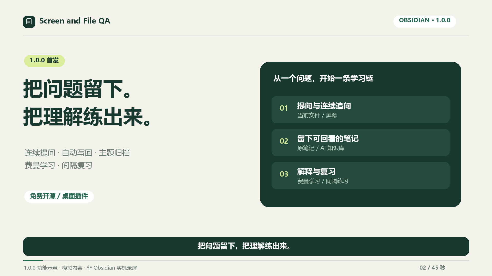
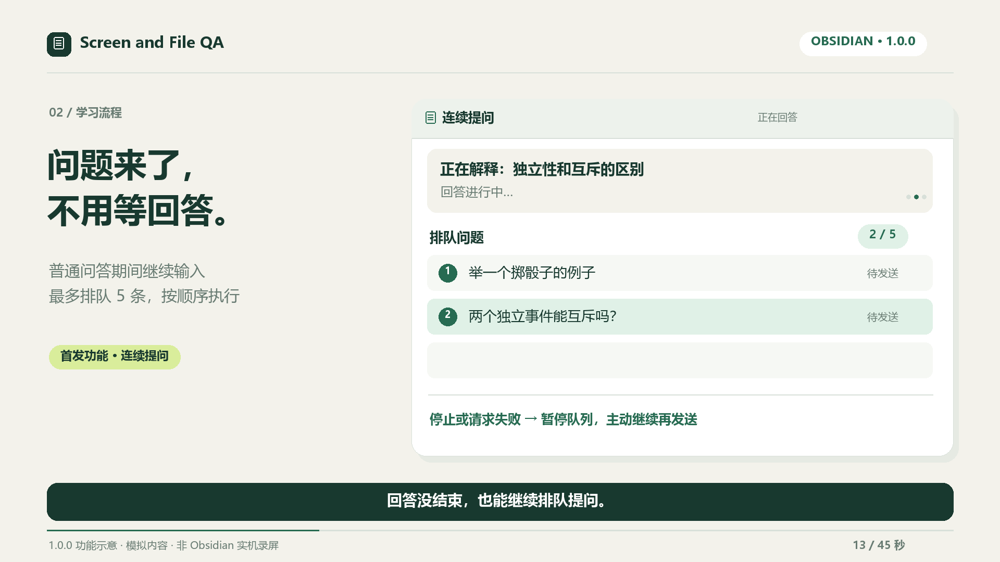
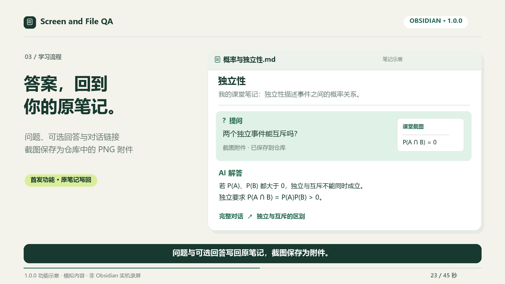
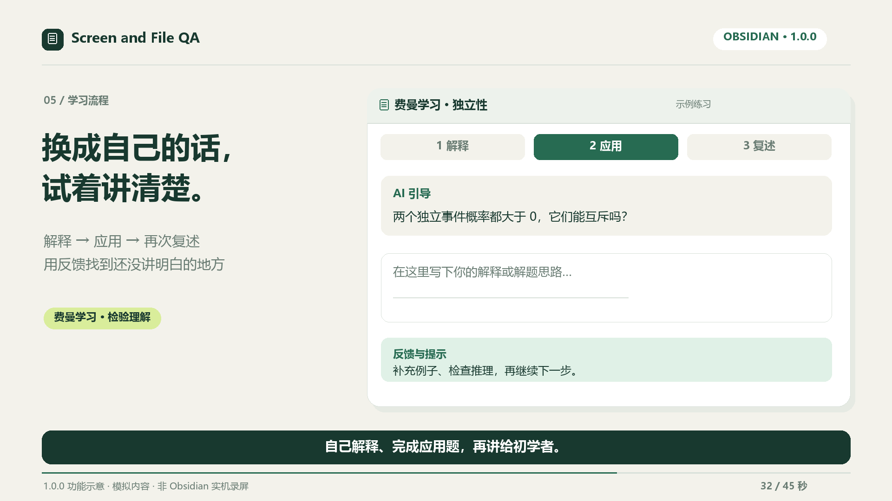
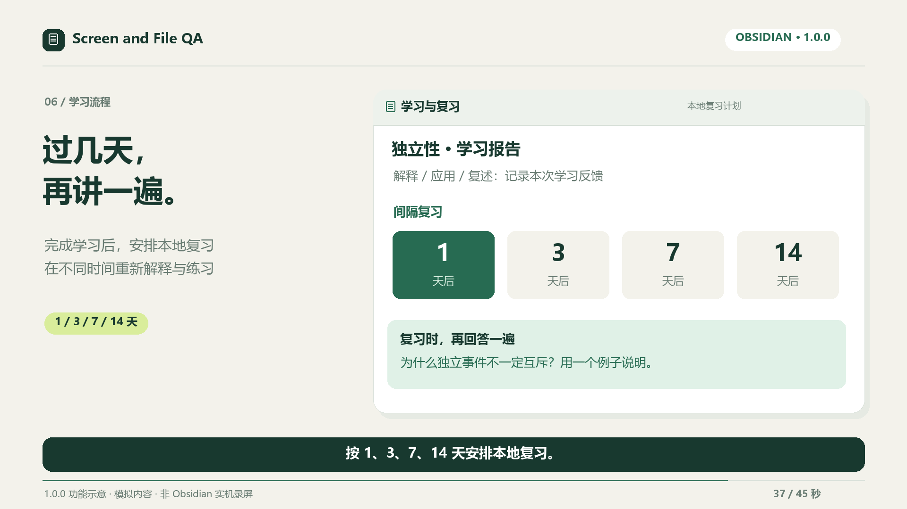
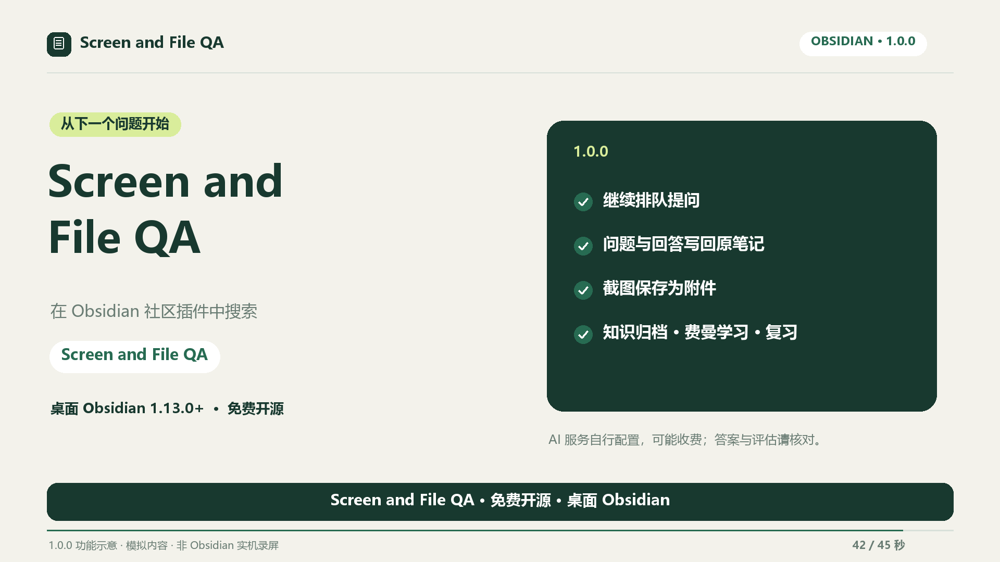

# 1.0.0 首发功能示意

这些图片取自首发宣传片，使用虚构内容与重新绘制的功能示意，非原生 Obsidian 实机截图。

## 学习链 / Learning flow

## 问答与自动保存 / Q&A and saving

## 连续问题 / Queued questions

## 原笔记与附件 / Source notes and attachments

## 主题归档 / Topic archiving

## 费曼学习 / Feynman practice

## 间隔复习 / Reviews

## 安装入口 / Installation

[GitHub 1.0.0 Release](https://github.com/clarkdonaldtfgbw5081-del/current-note-chat/releases/tag/1.0.0)
