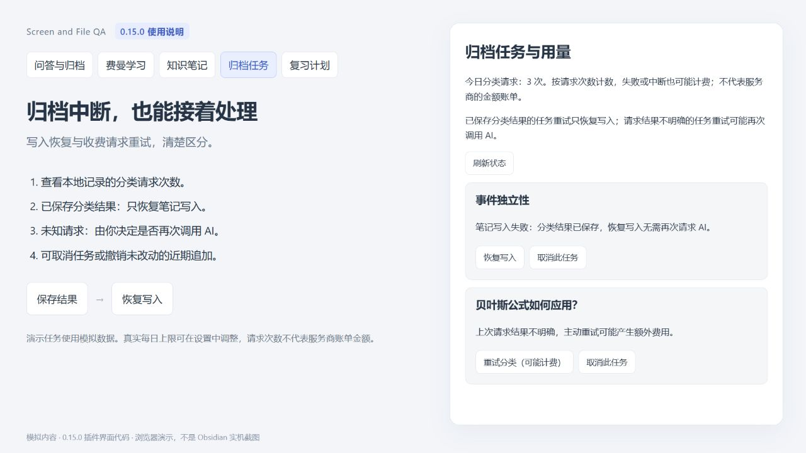
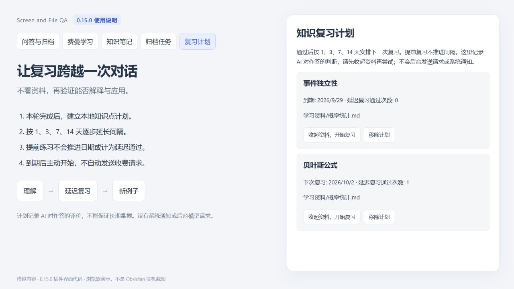
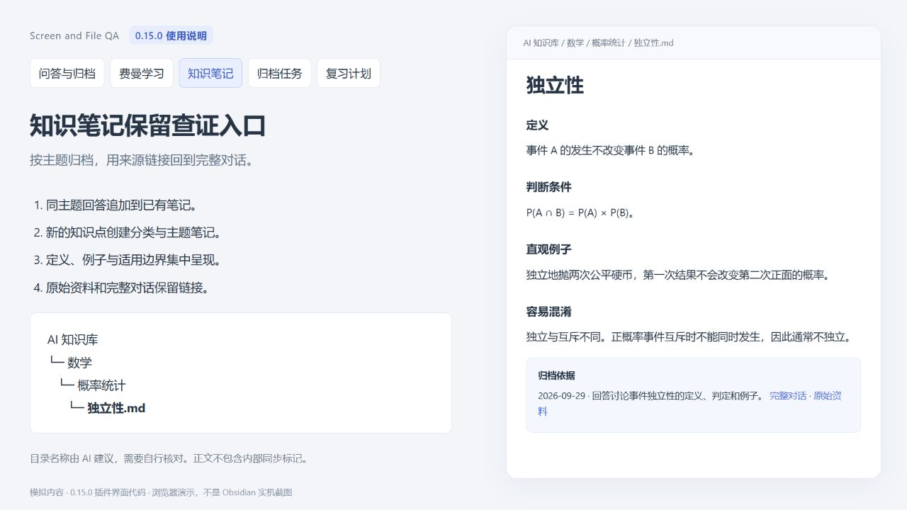
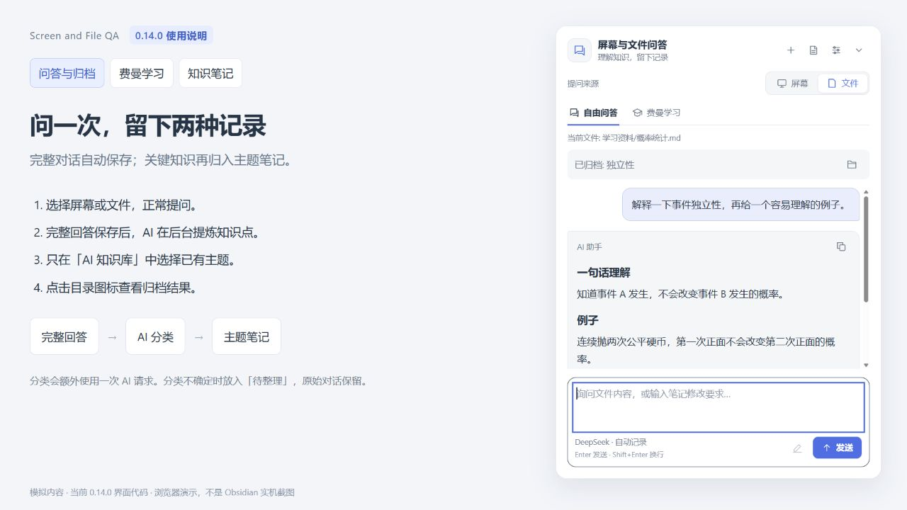
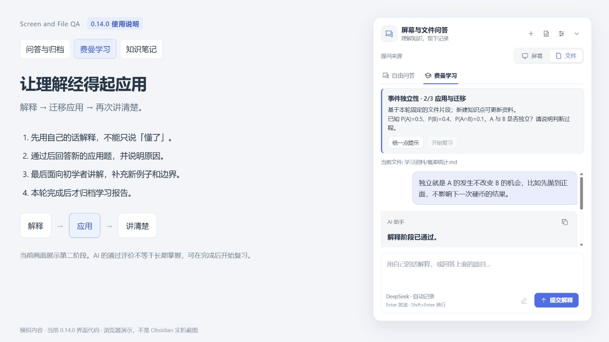
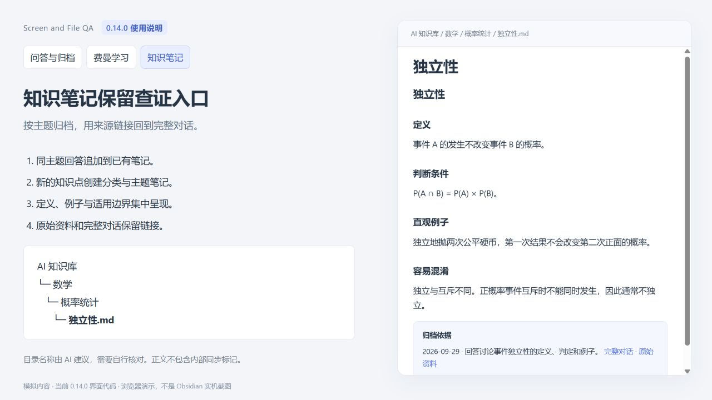

# 功能说明图：0.15.0 与 0.14.0

[English](SCREENSHOTS.md) · [返回说明](../README.zh-CN.md)

以下六张图使用对应版本的界面代码、模拟问答和内存中的演示笔记制作。没有读取用户笔记，没有调用 AI 服务，也没有产生 API 费用。外围布局、弹窗容器、主题颜色、图标与 Markdown 渲染使用演示环境，不能代替 Obsidian 实机、公式渲染或多主题兼容性验证。

## 0.15.0：归档任务与用量

已保存分类结果的任务提供“恢复写入”；请求结果不明确的任务提供“重试分类（可能计费）”。可在这里取消任务、查看近期追加并安全撤销。演示中的两条失败任务和请求次数都是模拟数据。

## 0.15.0：知识复习计划

本轮费曼学习完成后记录计划，按 1、3、7、14 天逐步安排。提前练习不推进间隔。到期后主动开始，计划不会后台发送 AI 请求或系统通知。通过次数是作答评估记录，不能保证长期掌握。

## 0.15.0：优化后的知识笔记

当前写入代码生成的模拟笔记取消了重复主题标题，集中呈现定义、条件、例子与误区，末尾保留来源。相同正文可去重；整篇语义整理通过“整理当前知识笔记（预览）”命令进行，需审阅后应用。详细边界见[优化实施记录](OPTIMIZATION_PROGRESS.zh-CN.md)。

下面保留 0.14.0 的历史说明图。“当前”仅指该版本发布时的实现。

## 1. 问答与自动归档

选择“屏幕”或“文件”提问，完整对话默认保存到同一篇笔记。AI 分类另用一次请求，将回答摘要归入知识目录；“已归档”右侧的目录图标打开目标笔记。示例路径为 `AI 知识库/数学/概率统计/独立性.md`，分类名称由模型建议，并非固定模板。把握不足或分类失败时放入“待整理”。

可在设置中关闭“AI 自动分类归档”，修改知识目录，或改变对话自动保存方式。候选名称和路径仅限知识目录；关闭自动保存也停止自动归档。

## 2. 费曼学习

先用自己的话解释，解释通过后做新的应用题，最后面向初学者再次讲清楚。图中处于第二阶段，展示如何检验是否真的会用判断条件。提示不计入通过，学习报告在本轮完成后归档；完整作答过程继续保存在对话笔记中。

一次通过代表 AI 对本轮回答的评价。建议之后脱离资料复习，并检查关键结论和公式。

## 3. 生成的知识笔记

图中正文由当前 `KnowledgeNotes` 写入逻辑生成，分类模型的返回值使用模拟数据。笔记保留定义、判断条件、例子和容易混淆的概念，并在末尾链接完整对话和原始资料。没有把内部同步 ID 写进正文。

0.14.0 的同主题归档采用追加段落；图中的重复标题已在 0.15.0 新建笔记模板中取消。旧笔记可使用新的整理预览命令审阅修改。

## 安装与发布状态

2026-09-29 已核实：

- [GitHub 0.15.0 Release](https://github.com/clarkdonaldtfgbw5081-del/current-note-chat/releases/tag/0.15.0)已公开，114 项测试与 Windows、macOS、Linux 自动检查均通过。
- [Obsidian 官方插件页面](https://community.obsidian.md/plugins/current-note-chat)已公开，显示当前版本 0.15.0，提供 **Add to Obsidian**；发行提交 `84d0466` 的自动审核状态为 **Completed**，健康状态 **Excellent**，审核评分 **Satisfactory**。构建逐字节复现、发行文件签名验证通过，旧版的仓库枚举提示已消失；可选 Codex、复制与 PDF 依赖相关能力提示仍保留。
- 在 Obsidian 的“第三方插件 → 浏览”中搜索 **Screen and File QA**。如果你本地仍在运行旧界面，重启 Obsidian 或重新加载插件，并在已安装列表确认版本。

状态会随后续版本变化；以上为注明日期时核实的结果。
