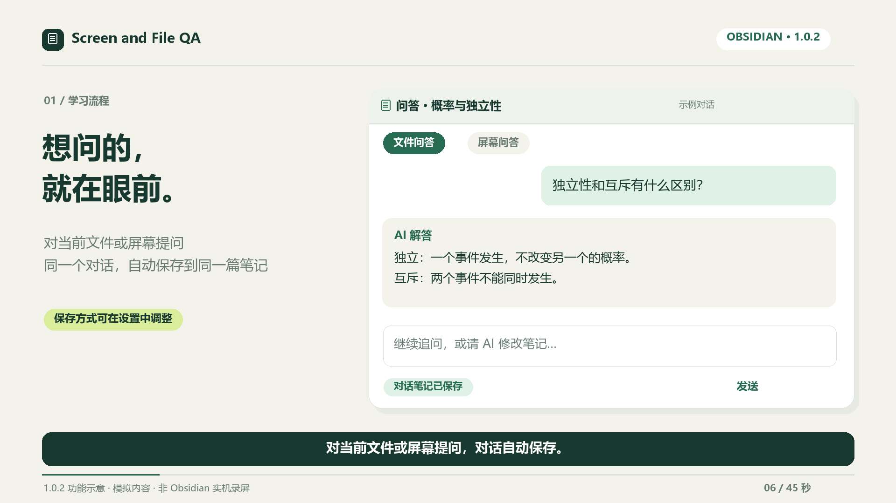
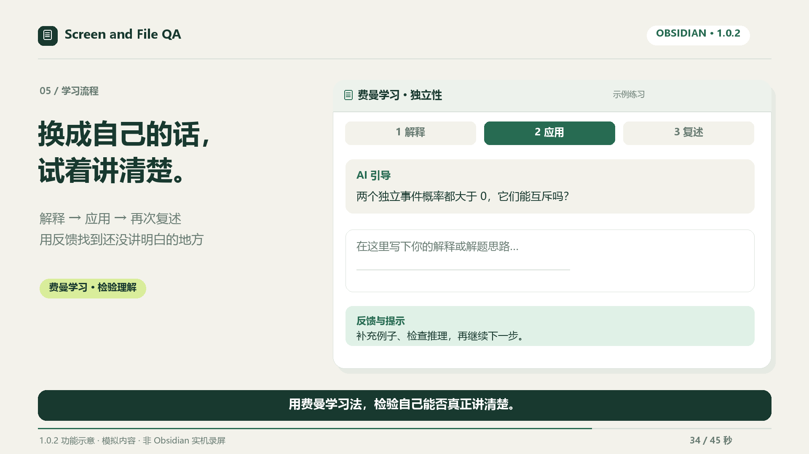
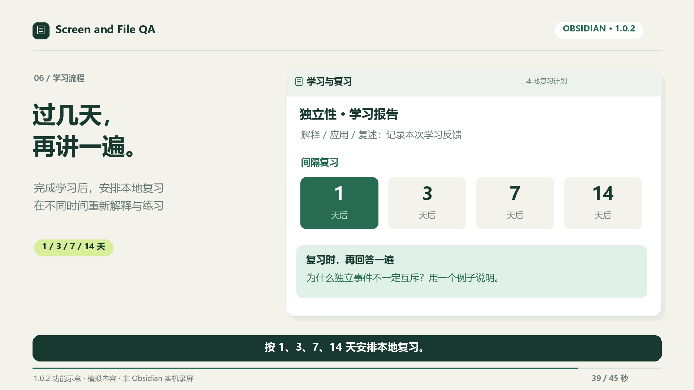

# 1.0.2 宣传片：提问，也要留在知识笔记里

[观看 45 秒视频](Screen-and-File-QA-1.0.2-45s.mp4) · [封面](封面.png) · [中文字幕](中文字幕.srt) · [项目首页](../../../README.zh-CN.md)

视频为 1920×1080、16:9、30 fps，无配音或音乐。所有问题和笔记内容均为虚构示例，画面是重新绘制的功能示意，**不是 Obsidian 实机录屏**。

## 图解学习流程

1. **提出问题，自动保存对话。** 对当前文件或屏幕提问；一个对话默认更新同一篇 Markdown 笔记。

   

2. **按需写回原笔记。** 可选择把问题、回答和完整对话链接写到被提问的 Markdown 笔记；截图另存为仓库附件。

   

3. **归入主题知识笔记。** 1.0.2 开始，新归档先显示原始**文字提问**，再显示 AI 摘要与来源链接。分类范围限于设置的知识目录；不确定的内容进入待整理。

   

4. **保留每次追问。** 即使后一次的摘要与已有内容相同，这次提问也仍会出现在主题笔记中。

   

5. **检验理解并复习。** 用自己的话解释、完成应用题、再讲给初学者；之后可安排本地间隔复习。

   

   

旧知识笔记不会自动补写问题，以免覆盖手工内容或猜测已经丢失的原始提问。屏幕问答记录用户输入的文字；如果只输入“解答 14、15、16”，插件不会从截图中重建完整题干。AI 分类和回答可能出错，请自行核对。

## 可编辑工程

`render_video.py` 生成封面、分镜、字幕和视频；`verify_media.py` 校验输出参数并生成 `production.json`。需要 Python 3、Pillow、imageio-ffmpeg 和 Windows 微软雅黑字体。安装 Python 依赖后，在本目录运行 `python render_video.py`。使用 `--preview` 只生成图片和字幕。
